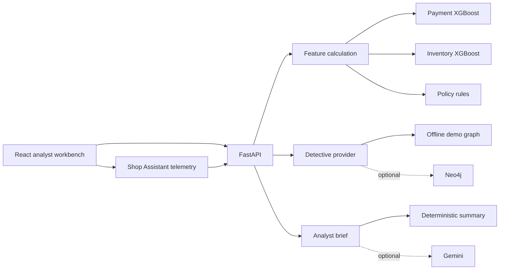

# Sentinel — Travel Booking Risk Assessment

> Explainable AI for payment fraud & inventory abuse detection in travel bookings.

[](https://www.python.org/)
[](https://fastapi.tiangolo.com/)
[](https://reactjs.org/)
[](https://xgboost.readthedocs.io/)
[](LICENSE)

---

## Overview

Sentinel is a full-stack research prototype that screens travel-agent bookings for two distinct fraud vectors:

1. **Payment Fraud** — Use of a compromised payment token or stolen credentials
2. **Inventory Abuse** — Repeated bulk holds followed by late cancellations

It combines XGBoost predictions, transparent policy rules, form-interaction telemetry, a relationship graph, and an optional Gemini AI analyst brief. It recommends **Approve**, **Manual Review**, or **Block** — but does not make autonomous production decisions.

> **Evidence boundary:** The included 15,000-row dataset is synthetic and reproducibly generated (seed `20260823`). Reported metrics verify implementation on generated patterns; they are not claims about real travel-industry performance.

---

## Architecture



---

## Features

| Module | Description |
|---|---|
| 🔐 **Gatekeeper** | Separate payment-fraud and inventory-abuse XGBoost models + auditable policy guardrails |
| 📋 **Shop Assistant** | Optional live capture of elapsed form time, paste count, and pointer events |
| 🔍 **Detective** | Interactive entity relationship graph — offline demo or live Neo4j |
| 🤖 **Analyst Assistant** | Evidence-only local brief + optional Gemini generation (no PII sent) |
| 📁 **Human Review Queue** | Session case queue populated by completed assessments |
| 📊 **Evaluation Dashboard** | Chronological holdout · Precision · Recall · PR-AUC · ROC-AUC · Confusion matrices |

---

## Measured Synthetic Test Results

| Model | Precision | Recall | PR-AUC | False-Positive Rate |
|---|---:|---:|---:|---:|
| Payment Fraud | 0.7571 | 0.3706 | 0.4858 | 0.0082 |
| Inventory Abuse | 0.8229 | 0.6320 | 0.6714 | 0.0172 |

> The payment model misses many generated fraud cases at threshold `0.50`. This limitation is intentionally visible in the application.

---

## Requirements

- Python 3.11+
- Node.js 20+
- npm 10+
- macOS: `brew install libomp` (required for XGBoost)

---

## Quick Start

### 1. Install Dependencies

```bash
# Backend
pip3 install -e "./backend[dev,notebook]"

# Frontend
cd frontend && npm install && cd ..
```

### 2. Train Models (optional — pre-trained artifacts included)

```bash
cd backend && python3 -m ml.train && cd ..
```

### 3. Run the Application

**Terminal 1 — Backend:**
```bash
cd backend
python3 -m uvicorn app.main:app --host 127.0.0.1 --port 8000
```

**Terminal 2 — Frontend:**
```bash
cd frontend
npm run dev -- --host 127.0.0.1
```

Open **[http://127.0.0.1:5173](http://127.0.0.1:5173)**

---

## Optional Integrations

### Gemini AI
Set `GEMINI_API_KEY` (and optionally `GEMINI_MODEL`, defaults to `gemini-3.7-flash`).  
Only scores and evidence labels are sent — never booking or agent IDs.  
Falls back to `offline_fallback` when unavailable.

### Neo4j Graph Database
Set `NEO4J_URI`, `NEO4J_USERNAME`, `NEO4J_PASSWORD`, and optionally `NEO4J_DATABASE`.  
Falls back to `offline_demo` on connection failure — never returns invented data.

Copy values from [backend/.env.example](backend/.env.example). Do not commit API keys.

---

## Project Structure

```
sentinel-travel-risk-lab/
├── backend/
│   ├── app/              # FastAPI application
│   │   ├── main.py       # API routes & WebSocket
│   │   ├── model_service.py  # XGBoost model loading
│   │   ├── features.py   # Feature engineering
│   │   ├── risk.py       # Risk scoring & policy rules
│   │   ├── detective.py  # Graph relationship provider
│   │   └── briefing.py   # Analyst brief generator
│   ├── ml/               # Training pipeline
│   │   ├── generate_data.py  # Synthetic data generator
│   │   └── train.py      # Model training & evaluation
│   ├── artifacts/        # Pre-trained model JSON + metadata
│   ├── data/             # Synthetic booking dataset (15k rows)
│   └── tests/            # pytest test suite
├── frontend/
│   ├── src/
│   │   ├── views/        # AssessmentView · CasesView · ModelView · NetworkView
│   │   ├── components/   # Inputs · ResultPanel
│   │   ├── api.ts        # Backend API client
│   │   └── assessment.ts # Assessment logic
│   └── index.html
├── docs/
│   ├── PRD.md            # Product Requirements Document ← this file
│   ├── architecture.md   # Full system architecture & sequence diagrams
│   ├── final_report.md   # Implementation & evaluation report
│   ├── presentation.md   # Slide-ready presentation
│   ├── demo_script.md    # Five-minute live demonstration guide
│   └── test-screenshots/ # Screenshot evidence
├── notebooks/
│   └── model_evaluation.executed.ipynb  # Executed evaluation notebook
├── TESTS.md              # Visual and automated test dossier
└── travel_fraud_research_roadmap.md
```

---

## Running Tests

```bash
# Backend unit tests
cd backend && python3 -m pytest -q && cd ..

# Frontend tests + build + lint
cd frontend && npm test && npm run build && npm run lint
```

---

## Documentation

| Document | Description |
|---|---|
| [docs/PRD.md](docs/PRD.md) | Product Requirements Document — features, goals, constraints |
| [docs/architecture.md](docs/architecture.md) | Complete architecture, sequence diagrams, feature guide |
| [docs/final_report.md](docs/final_report.md) | Implementation and evaluation report |
| [docs/presentation.md](docs/presentation.md) | Slide-ready presentation |
| [docs/demo_script.md](docs/demo_script.md) | Five-minute live demonstration |
| [TESTS.md](TESTS.md) | Visual and automated test dossier with screenshot evidence |
| [notebooks/model_evaluation.executed.ipynb](notebooks/model_evaluation.executed.ipynb) | Executed evaluation notebook |

---

## Safety & Limitations

> ⚠️ This is a research prototype and must **not** be used for production decisions without:

- Lawful outcome data from real bookings
- Leakage analysis and temporal validation
- Model calibration and subgroup fairness testing
- Outcome monitoring, drift detection, and human appeal processes

- Geography, time of day, or telemetry must **never** independently prove fraud
- SHAP contributions explain model influence — **not causation or guilt**
- A real deployment requires access control, retention rules, and legal review

---

## Author

**AASTHA381** · [github.com/AASTHA381](https://github.com/AASTHA381)
